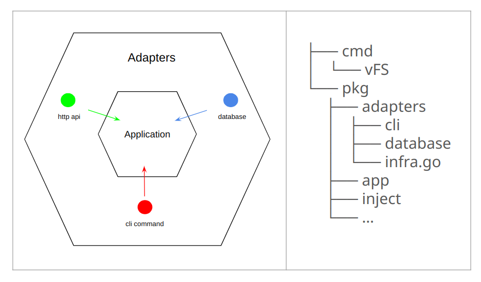

# Virtual File System (vFS)

- [Overview](#overview)
- [Setup](#setup)
  - [Prerequisites](#prerequisites)
  - [Installation](#installation)
- [Usage](#usage)
  - [User Registration](#user-registration)
  - [Folder Management](#folder-management)
  - [File Management](#file-management)
- [Input Validation](#input-validation)
  - [User Names](#user-names)
  - [Folder Names](#folder-names)
  - [File Names](#file-names)
- [Software Architecture](#software-architecture)
  - [adapters](#adapters)
    - [cli](#cli)
    - [database](#database)
  - [app](#app)
  - [inject](#inject)
  - [pkg](#pkg)
- [Unit Testing](#unit-testing)


## Overview

This project implements a virtual file system as a command line program.  
It supports user, folder, and file management function.  

## Setup

### Prerequisites

- **Go 1.20+** installed.
- **$GOBIN** (Go binary path) must be in the system's PATH.

### Installation

1. install command:
    ```bash
    go install github.com/KScaesar/IsCoolLab2024/cmd/vFS@latest
    ```

2. install shell completion:
    ```bash
    source <(vFS completion bash)
    source <(vFS completion zsh)
    ```

3. run the command:
    ```bash
    ```

## Usage


### User Registration

```bash
vFS register [username]
```
- **Response**:
    - `Add [username] successfully.`
    - `Error: The [username] has already existed.`

### Folder Management

```bash
vFS create-folder [username] [foldername] [description]?
vFS delete-folder [username] [foldername]
vFS list-folders [username] [--sort-name|--sort-created] [asc|desc]
vFS rename-folder [username] [foldername] [new-folder-name]
```
- **Response**:
    - Create Folder: `Create [foldername] successfully.`
    - Delete Folder: `Delete [foldername] successfully.`
    - List Folders: `[foldername] [description] c[reated_at] [username]`
    - Rename Folder: `Rename [foldername] to [new-folder-name] successfully.`

### File Management

```bash
vFS create-file [username] [foldername] [filename] [description]?
vFS delete-file [username] [foldername] [filename]
vFS list-files [username] [foldername] [--sort-name|--sort-created] [asc|desc]
```
- **Response**:
    - Create File: `Create [filename] in [username]/[foldername] successfully.`
    - Delete File: `Delete [filename] in [username]/[foldername] successfully.`
    - List Files: `[filename] [description] [created_at] [foldername] [username]`

## Input Validation

### User Names

- **Maximum Length**: Up to 64 characters.
- **Allowed Characters**: Must consist of alphanumeric characters (a-z, A-Z, 0-9), underscores (_), and hyphens (-).
- **Case Insensitivity**: Usernames are case-insensitive and must be unique.
- **Examples**:
    - Valid: `user_123`, `User-Name`, `username`
    - Invalid: `user name`, `user!name`, `user@name`
    - `Error: The [username] contains invalid characters or exceeds the length limit.`


### Folder Names

- **Maximum Length**: Up to 256 characters.
- **Allowed Characters**: Must consist of alphanumeric characters (a-z, A-Z, 0-9), underscores (_), hyphens (-), and spaces.
- **Case Insensitivity**: Folder names are case-insensitive and must be unique within the user's scope.
- **Examples**:
    - Valid: `Folder_123`, `Folder Name`, `folder-name`
    - Invalid: `Folder!Name`, `Folder@Name`
    - `Error: The [foldername] contains invalid characters or exceeds the length limit.`

### File Names

- **Maximum Length**: Up to 256 characters.
- **Allowed Characters**: Must consist of alphanumeric characters (a-z, A-Z, 0-9), underscores (_), hyphens (-), dots (.), and spaces.
- **Case Insensitivity**: File names are case-insensitive and must be unique within the folder.
- **Examples**:
    - Valid: `file_123.txt`, `File Name.txt`, `file-name.txt`
    - Invalid: `file!name.txt`, `file@name.txt`
    - `Error: The [filename] contains invalid characters or exceeds the length limit.`

## Software Architecture



此軟體架構的精神是把應用程式的核心邏輯 (application) 與外部世界 (adapters) 的依賴分離，來提高應用程式的可測試性、可擴展性和可維護性。

這種架構使得應用程式的核心邏輯可以不受外部技術變化的影響，從而更加穩定和可靠，箭頭方向表示依賴方向，也就是 adapter 依賴 application 。

### adapters

Responsible for handling interactions with the external world, connecting external systems, user interfaces, etc., to the application.

#### cli

負責處理應用程式對外的 cli 接口.

接收外部請求並將其轉換為應用程式可以理解的 command 或 query.

#### database

儲存、查詢和管理資料的功能.

### app

The main business logic of the application.

### inject

存放依賴注入所需程式碼的地方, 包括依賴關係的定義以及相關的注入點。

通過組織這些程式碼，我們可以更容易地管理和維護依賴注入的相關邏輯，並在整個應用程序中更加清晰地定義和處理相依性。

### pkg

工具函數庫, 類似 AOP（Aspect-Oriented Programming）的概念

## Unit Testing

Run unit tests using:
```bash
go test ./...
```
